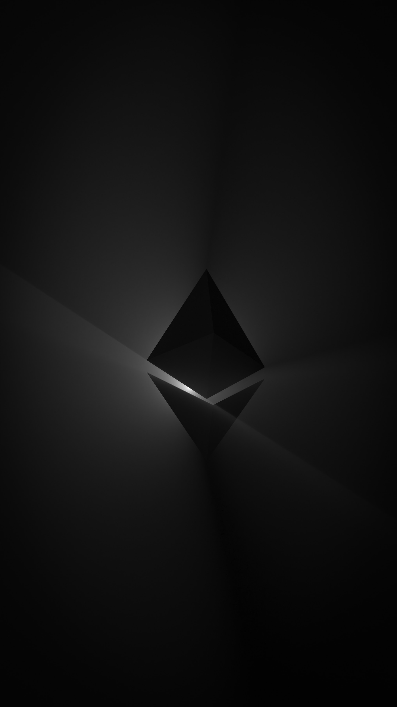
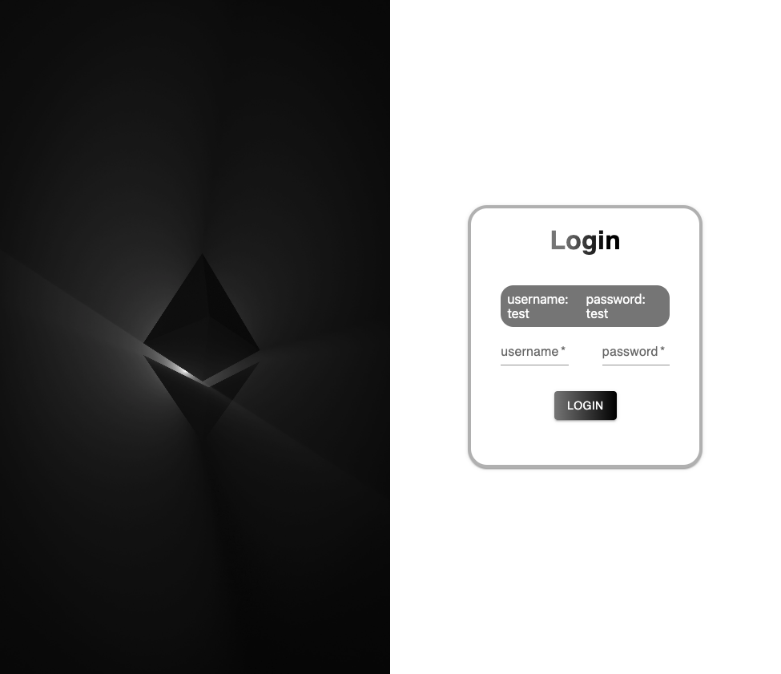
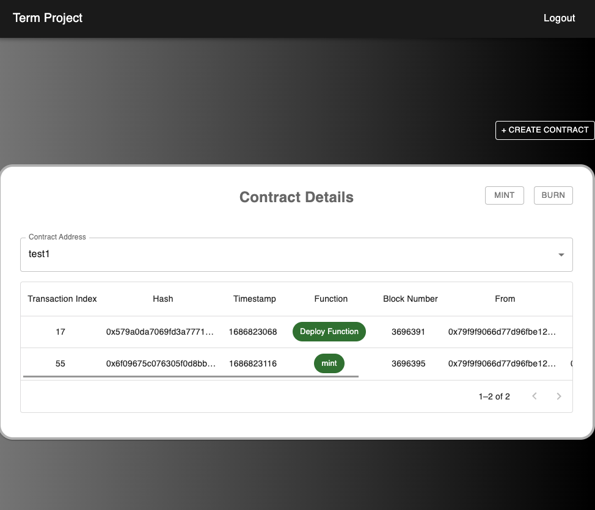
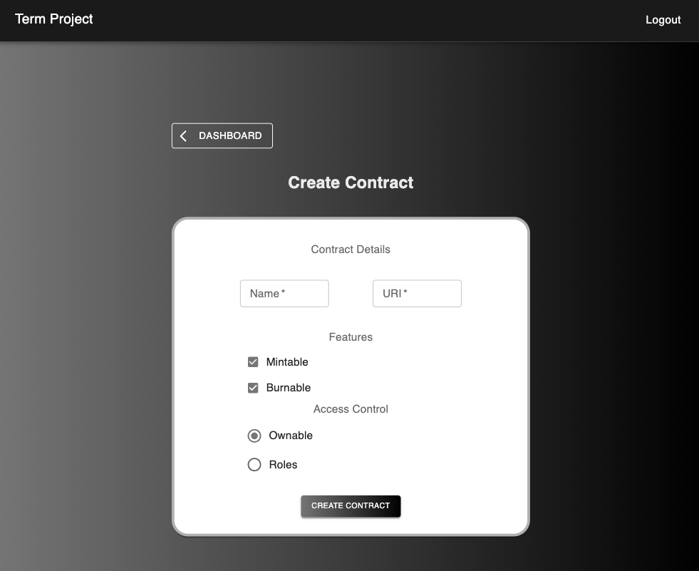

# Term Project Frontend

<!-- PROJECT LOGO -->

    

 
 

<!-- TABLE OF CONTENTS -->

  
Table of Contents

  <ol>
    <li>
        <a href="#built-with">Built With</a>
    </li>
    <li><a href="#pages">Pages</a></li>
    <li><a href="#contact">Contact</a></li>
  </ol>

## About The Project

  This project was developed for term project frontend which is an API that automatically generates NFTs for in-game items on Blockchain Networks.

### Built With

* [![React][React.js]][React-url]
* [![Next][Next]][Next-url]

(<a href="#readme-top">back to top</a>)

## Pages
#### Login
  
  
#### Dashboard
  
  
#### Create Contract
  

(<a href="#readme-top">back to top</a>)

## Contact
Project Link: [https://github.com/sefakrb/term-project-frontend](https://github.com/sefakrb/term-project-frontend)

(<a href="#readme-top">back to top</a>)

<!-- MARKDOWN LINKS & IMAGES -->
<!-- https://www.markdownguide.org/basic-syntax/#reference-style-links -->
[React.js]: https://img.shields.io/badge/React-20232A?style=for-the-badge&logo=react&logoColor=61DAFB
[React-url]: https://react.dev/
[Next]: https://img.shields.io/badge/Next-002E3B?style=for-the-badge&logo=nextdotjs&logoColor=#00DC82
[Next-url]: https://nextjs.org/
